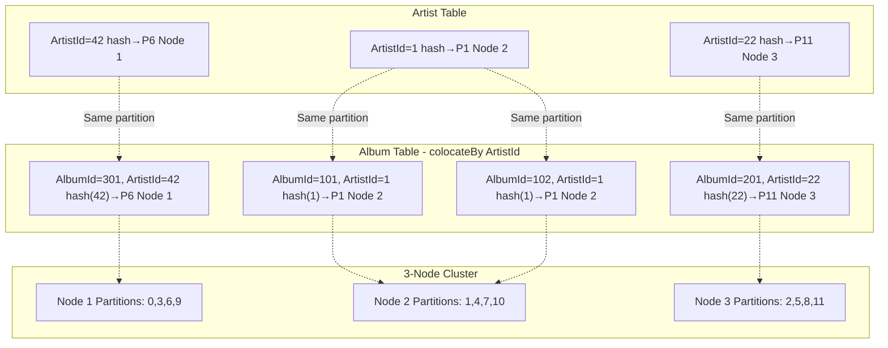

# Schema Design for Distributed Systems: Why Data Placement Matters

You can scale out your database, add more nodes, and tune every index, but if your data isn’t in the right place, performance still hits a wall. Every distributed system eventually runs into this: joins that cross the network, caches that can’t keep up, and queries that feel slower the larger your cluster gets.

<!-- truncate -->

Most distributed SQL databases claim to solve scalability. They partition data evenly, replicate it across nodes, and promise linear performance. But *how* data is distributed and *which* records end up together matters more than most people realize. If related data lands on different nodes, every query has to travel the network to fetch it, and each millisecond adds up.

That’s where **data placement** becomes the real scaling strategy.  

Apache Ignite 3 takes a different path with **schema-driven colocation** — a way to keep related data physically together. Instead of spreading rows randomly across nodes, Ignite uses your schema relationships to decide where data lives. The result: a 200 ms cross-node query becomes a 5 ms local read.

---

## How Ignite 3 Differs from Other Distributed Databases

**Traditional Distributed SQL Databases:**

- Hash-based partitioning ignores data relationships  
- Related data scattered across nodes by default  
- Cross-node joins create network bottlenecks  
- Millisecond latencies due to disk-first architecture  

**Ignite 3 Schema-Driven Approach:**

- Colocation configuration in schema definitions  
- Related data automatically placed together  
- Local queries eliminate network overhead  
- Microsecond latencies through memory-first storage  

---

## The Distributed Data Placement Problem

You’ve tuned indexes, optimized queries, and scaled your cluster—but latency still creeps in.  
The problem isn’t your SQL -- it’s where your data lives.  

Traditional hash-based partitioning distributes records randomly across nodes based on primary key values.  
While this ensures even data distribution, it scatters related records that applications frequently access together.  
It’s a clever approach—until you need to join data that doesn’t share the same key.  
Then every query turns into a distributed operation, and your network becomes the bottleneck.

Ignite 3 provides automatic colocation based on schema relationships.  
You define relationships directly in your schema, and Ignite automatically places related data on the same nodes using the specified colocation keys.

Using a [music catalog example](https://github.com/lerocha/chinook-database/tree/master),  
we’ll demonstrate how schema-driven data placement reduces query latency from 200 ms to 5 ms.

> This post assumes you have a basic understanding of how to get an Ignite 3 cluster running and have worked with the Ignite 3 Java API.  
> If you're new to Ignite 3, start with the [Java API quick start guide](/docs/ignite3/3.1.0/getting-started/key-value-api) to set up your development environment.

---

## How Ignite 3 Places Data Differently

Tables are distributed across multiple nodes using consistent hashing, but with a key difference:  
your schema definitions control data placement.  
Instead of accepting random distribution of related records, you declare relationships in your schema and let Ignite handle placement automatically.

**Partitioning Fundamentals:**

- Each table is divided into partitions (typically 64–1024 per table)  
- Primary key hash determines which partition data goes into  
- Partitions are distributed evenly across available nodes  
- Each partition has configurable replicas for fault tolerance  

**Data Placement Concepts:**

- **Affinity** – the algorithm that determines which nodes store which partitions  
- **Colocation** – ensuring related data from different tables gets placed on the same nodes  

The diagram below shows how colocation works in practice.  
Artist and Album tables use different primary keys, but colocation strategy ensures albums are partitioned by `ArtistId` rather than `AlbumId`:



Colocation configuration in your schema ensures that Album records use the `ArtistId` value (not `AlbumId`) for partition assignment.  
This guarantees that Artist 1 and all albums with `ArtistId = 1` hash to the same partition and therefore live on the same nodes.

---

## Distribution Zones and Data Placement

Distribution zones are cluster-level configurations that define how data is distributed and replicated.

> **Zone Creation Options:** Ignite 3 supports multiple approaches:  
> 1. **SQL DDL** – `CREATE ZONE` statements  
> 2. **Java Builder API** – programmatic `ZoneDefinition.builder()`  
>  
> We use the Java Builder API here for consistency with our programmatic schema examples.

A distribution zone specifies:

- **Partition count** – how many partitions your data is divided into (typically 64–1024 per table)  
- **Replica count** – how many copies of each partition exist for fault tolerance  
- **Node filters** – which nodes can store data for this zone  

First, create the distribution zones:

```java
// Create the standard zone for frequently updated data
ignite.catalog().create(ZoneDefinition.builder("MusicStore")
    .replicas(2)
    .storageProfiles("default")
    .build()).execute();

// Create the replicated zone for reference data (replicas = cluster size)
ignite.catalog().create(ZoneDefinition.builder("MusicStoreReplicated")
    .replicas(clusterNodes().size()) 
    .storageProfiles("default")
    .build()).execute();
```

---

## Building Your Music Platform Schema

> **Schema Creation:** Ignite 3 supports three approaches:  
> 1. **SQL DDL** – traditional `CREATE TABLE` statements  
> 2. **Java Annotations API** – POJO markup with `@Table`, `@Column`, etc.  
> 3. **Java Builder API** – programmatic `TableDefinition.builder()`  
>  
> We use the Annotations API here for its clarity and type safety.

The Artist table establishes the partitioning strategy that dependent tables will follow through colocation:

```java
@Table(zone = @Zone(value = "MusicStore", storageProfiles = "default"))
public class Artist {
    @Id
    @Column(value = "ArtistId", nullable = false)
    private Integer ArtistId;
    
    @Column(value = "Name", nullable = false, length = 120)
    private String Name;
    
    public Artist() {}
    
    public Artist(Integer artistId, String name) {
        this.ArtistId = artistId;
        this.Name = name;
    }
    
    public Integer getArtistId() { return ArtistId; }
    public void setArtistId(Integer artistId) { this.ArtistId = artistId; }
    public String getName() { return Name; }
    public void setName(String name) { this.Name = name; }
}
```

---

## Parent–Child Colocation Implementation

When users search for "The Beatles", they expect both artist details and album listings in the same query.  
Without colocation, this requires cross-node joins that can take 40–200 ms.

We solve this by setting `colocateBy` in the `@Table` annotation:

```java
@Table(
    zone = @Zone(value = "MusicStore", storageProfiles = "default"),
    colocateBy = @ColumnRef("ArtistId")
)
public class Album {
    @Id
    @Column(value = "AlbumId", nullable = false)
    private Integer AlbumId;
    
    @Id
    @Column(value = "ArtistId", nullable = false)
    private Integer ArtistId;
    
    @Column(value = "Title", nullable = false, length = 160)
    private String Title;
    
    @Column(value = "ReleaseDate", nullable = true)
    private LocalDate ReleaseDate;
    
    // Constructors and getters/setters...
}
```

The colocation field (`ArtistId`) must be part of the composite primary key.  
Ignite uses the `ArtistId` value to ensure albums with the same artist live on the same nodes as their corresponding artist record.

---

## Performance Impact: Memory-First + Colocation

Let’s quantify the effect of combining memory-first storage with schema-driven colocation.

**Without Colocation – Data Scattered:**

```java
Artist artist = artistView.get(null, artistKey);              // Node 2
Collection<Album> albums = albumView.getAll(null, albumKeys); // Nodes 1,2,3
// Result: 3 network operations for related data
// Query time: 40–200 ms (network latency × nodes involved)
```

**With Memory-First + Colocation – Data Local:**

```java
Artist artist = artistView.get(null, artistKey);              // Node 2
Collection<Album> albums = albumView.getAll(null, albumKeys); // Node 2
// Result: 1 node involved, local memory access
// Query time: 1–5 ms (memory access + no network hops)
```

The performance difference combines **memory-first storage** with **schema-driven colocation**:

- **Query latency reduction:** 200 ms → 5 ms (memory access + no network hops)  
- **Network traffic elimination:** related data queries become local operations  
- **Resource efficiency:** CPU focuses on serving requests instead of moving data  

---

## Colocation Enables Compute-to-Data Processing

Schema-driven colocation doesn’t just optimize queries—it enables processing where data lives:

```java
// Process all albums for an artist locally
ComputeJob<RecommendationResult> job = ComputeJob.colocated("Artist", artistId,
    AlbumRecommendationJob.class);
    
// Runs on the same node where artist and album data live
CompletableFuture<RecommendationResult> result = ignite.compute()
    .submitAsync(job, preferences);
```

Instead of moving gigabytes of album data to a compute cluster, you move kilobytes of logic to where the data already resides.

---

## Implementation Guide

Deploy tables in dependency order to avoid colocation reference errors:

```java
try (IgniteClient client = IgniteClient.builder()
        .addresses("127.0.0.1:10800")
        .build()) {
    
    // 1. Reference tables with no dependencies
    client.catalog().createTable(Genre.class);
    
    // 2. Root entities
    client.catalog().createTable(Artist.class);
    
    // 3. Dependent entities in hierarchy order
    client.catalog().createTable(Album.class);      // References Artist
    client.catalog().createTable(Track.class);      // References Album
}
```

---

## Accessing Your Distributed Data

Ignite 3 provides multiple views of the same colocated data:

```java
// RecordView for entity operations
RecordView<Artist> artists = client.tables()
    .table("Artist")
    .recordView(Artist.class);

// Operations with partition keys route to single nodes
Artist beatles = new Artist(1, "The Beatles");
artists.upsert(null, beatles);

Album abbeyRoad = new Album(1, 1, "Abbey Road", LocalDate.of(1969, 9, 26));
albums.upsert(null, abbeyRoad);  // Automatically colocated with artist
```

---

## Summary

Data placement is where distributed performance is won or lost.  
With **schema-driven colocation**, Apache Ignite 3 keeps related data together on the same nodes, so your queries stay local, fast, and predictable.

Instead of tuning around network latency, you design for it once at the schema level.  
Your joins stay local, your compute jobs run where the data lives, and scaling stops being a tradeoff between performance and size.

**Why it works:**  
- **Memory-first + colocation** → microsecond access to related data  
- **Schema-driven placement** → predictable performance at scale  
- **Compute-to-data** → logic runs with data, not across the network  
- **Unified platform** → transactions, analytics, and compute together  

When data lives together, your system scales naturally — without complexity creeping in.

Explore the [Ignite 3 documentation](/docs/) for detailed examples and API references.
