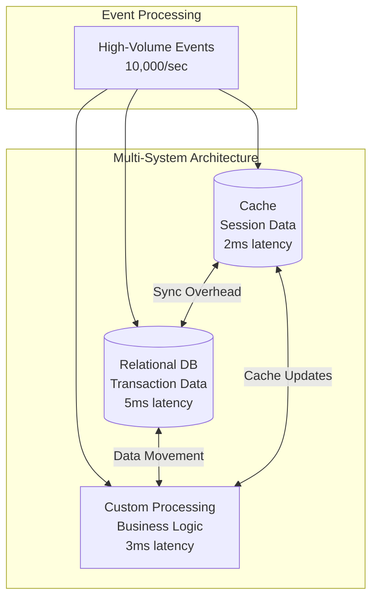
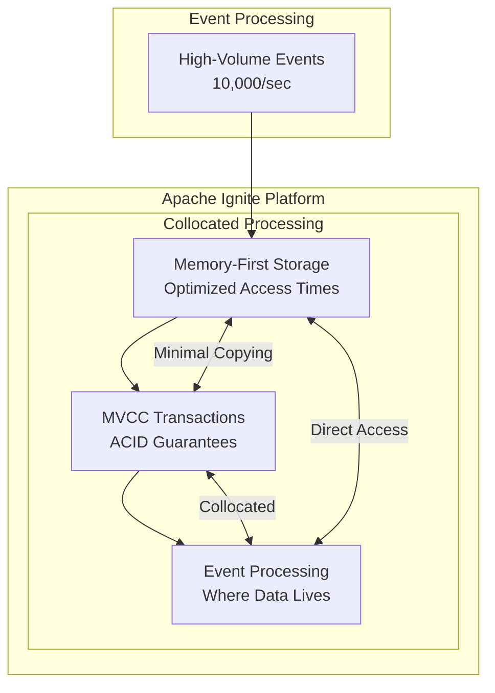

# Apache Ignite 3 Architecture Series: Part 1 — When Multi-System Complexity Compounds at Scale

Your high-velocity application began with smart architectural choices: PostgreSQL for reliable transactions, Redis for fast cache access, and custom processing for domain-specific logic. These decisions powered early success and growth.

<!-- truncate -->

But success changes the game. Your system now handles thousands of events per second, and customers expect microsecond-level response times. The same architectural choices that enabled growth now create performance bottlenecks that compound with every additional event.

**At high event volumes, data movement between systems becomes the primary performance constraint.**

_Part 1 of 8 in the Apache Ignite 3 Architecture Series_

---

## The Scale Reality for High-Velocity Applications

As event volume grows, architectural compromises that once seemed reasonable at lower scale become critical bottlenecks. Consider a financial trading platform, gaming backend, or IoT processor handling tens of thousands of operations per second.

### Event Processing Under Pressure

**High-frequency event characteristics**

- Events arrive faster than traditional batch processing can handle  
- Each event requires immediate consistency checks against live data  
- Results must update multiple downstream systems simultaneously  
- Network delays compound into user-visible lag  
- **Traffic spikes create systemic pressure** — traditional stacks drop connections or crash when overwhelmed  

**The compounding effect**

- At 100 events per second, network latency of 2ms adds minimal overhead. 
- At 10,000 events per second, that same 2ms latency creates a 20-second processing backlog within system boundaries. 
- During traffic spikes (50,000+ events/second), traditional systems collapse entirely, dropping connections and losing data when they're needed most. 

The math scales against you.

---

### When Smart Choices Become Scaling Limits

**Initial Architecture, works great at lower scale:**



**What happens at scale**

- **Network Latency Tax**: Every system hop adds milliseconds that compound
- **Synchronization Delays**: Keeping systems consistent creates processing queues
- **Memory Overhead**: Each system caches the same data in different formats
- **Consistency Windows**: Brief periods where systems show different data states 

---

### The Hidden Cost of Multi-System Success

**Data Movement Overhead:**

Your events don't just need processing, they need processing that maintains consistency across all systems. 

Each event triggers:

1. **Cache lookup** (cache): ≈ 0.5 ms network + processing
2. **Transaction validation** (relational db): ≈ 2 ms network + disk I/O  
3. **Business-logic execution** (custom logic): ≈ 1ms processing + data marshalling 
4. **Result synchronization** (across systems): ≈ 3 ms coordination overhead

**Minimum per-event cost ≈ 7 ms before business logic.** 

At 10,000 events/s, you’d need 70 seconds of processing capacity just *for data movement* per real-time second!

---

## The Performance Gap That Grows With Success

### Why Traditional Options Fail

**Option 1: Scale Out Each System**

- **Strategy**: Add cache clusters, database replicas, processing nodes
- **Result**: More systems to coordinate, exponentially more complexity
- **Reality**: Network overhead grows faster than processing capacity

**Option 2: Custom Optimization**  

- **Strategy**: Build application-layer caching, custom consistency protocols
- **Result**: Engineering team maintains complex, system-specific optimizations
- **Reality**: Solutions don't generalize; each optimization creates technical debt

**Option 3: Accept Performance Compromises**

- **Strategy**: Use async processing, eventual consistency,  and accept delayed insights
- **Result**: Business requirements compromised to fit architectural limitations
- **Reality**: Competitive disadvantage as customer expectations grow

---

### The Critical Performance Gap

| Component | Optimized for | Typical Latency |
|------------|---------------|----------------|
| Database | ACID transactions | Milliseconds |
| Cache | Access speed | Microseconds |
| Compute | Throughput | Minutes – hours |

Applications needing *microsecond insights* on *millisecond transactions* have no good options at scale in traditional architectures.

During traffic spikes, traditional architectures either drop connections (data loss) or degrade performance (missed SLAs). High-velocity applications need intelligent flow control that guarantees stability under pressure while preserving data integrity.

---

## Event Processing at Scale

**Here's what traditional multi-system event processing costs:**

```java
// Traditional multi-system event processing
long startTime = System.nanoTime();

// 1. Cache lookup for session data
String sessionData = redisClient.get("session:" + eventId);  // ~500μs network
if (sessionData == null) {
    sessionData = postgresDB.query("SELECT * FROM sessions WHERE id = ?", eventId);  // ~2ms fallback
    redisClient.setex("session:" + eventId, 300, sessionData);  // ~300μs cache update
}

// 2. Transaction processing
postgresDB.executeTransaction(tx -> {  // ~2-5ms transaction
    tx.execute("INSERT INTO events VALUES (?, ?, ?)", eventId, userId, eventData);
    tx.execute("UPDATE user_stats SET event_count = event_count + 1 WHERE user_id = ?", userId);
});

// 3. Custom processing with consistency coordination
ProcessingResult result = customProcessor.process(eventData, sessionData);  // ~1ms processing
redisClient.setex("result:" + eventId, 600, result);  // ~300μs result caching

// 4. Synchronization across systems
ensureConsistency(eventId, sessionData, result);  // ~2-3ms coordination

long totalTime = System.nanoTime() - startTime;
// Total: 6-12ms per event (not including queuing delays)
```

**Compound Effect at Scale:**

| Rate            | Required processing time/s |
| --------------- | -------------------------- |
| 1,000 events/s  | 6–12 seconds               |
| 5,000 events/s  | 30–60 seconds              |
| 10,000 events/s | 60–120 seconds             |

**The math doesn’t work:** parallelism helps, but coordination overhead grows exponentially with system count.

---

### Real-World Breaking Points

- **Financial Services**: Trading platforms hitting 10,000+ trades/second discover that compliance reporting delays impact trading decisions.

- **Gaming Platforms**: Multiplayer backends processing user actions find that leaderboard updates lag behind gameplay events.

- **IoT Analytics**: Manufacturing systems processing sensor data realize that anomaly detection arrives too late for preventive action.

---

## The Apache Ignite Alternative

### Eliminating Multi-System Overhead



**Key difference:** events process *where the data lives*, eliminating inter-system network latency.

---

### Apache Ignite 3 Performance Reality Check

**Here's the same event processing with integrated architecture:**

```java
// Apache Ignite 3 integrated event processing
try (IgniteClient client = IgniteClient.builder().addresses("cluster:10800").build()) {
    // Single integrated transaction spanning cache, database, and compute
    client.transactions().runInTransaction(tx -> {
        // 1. Access session data (in memory, no network overhead)
        Session session = client.tables().table("sessions")
            .keyValueView().get(tx, Tuple.create().set("id", eventId));
        
        // 2. Process event with ACID guarantees (same memory space)
        client.sql().execute(tx, "INSERT INTO events VALUES (?, ?, ?)", 
                           eventId, userId, eventData);
        
        // 3. Execute processing collocated with data
        ProcessingResult result = client.compute().execute(
            JobTarget.colocated("events", Tuple.create().set("id", eventId)), 
            EventProcessor.class, eventData);
        
        // 4. Update derived data (same transaction, guaranteed consistency)
        client.sql().execute(tx, "UPDATE user_stats SET event_count = event_count + 1 WHERE user_id = ?", userId);
        
        return result;
    });
}
// Result: microsecond-range event processing through integrated architecture
```

**Result**: Processing 10,000 events/s is achievable with integrated architecture eliminating network overhead.

---

### The Unified Data-Access Advantage

**Here's what eliminates the need for separate systems:**

```java
// The SAME data, THREE access paradigms, ONE system
Table customerTable = client.tables().table("customers");

// 1. Key-value access for cache-like performance
Customer customer = customerTable.keyValueView()
    .get(tx, Tuple.create().set("customer_id", customerId));

// 2. SQL access for complex analytics
ResultSet<SqlRow> analytics = client.sql().execute(tx, 
    "SELECT segment, AVG(order_value) FROM customers WHERE region = ?", region);

// 3. Record access for type-safe operations
CustomerRecord record = customerTable.recordView()
    .get(tx, new CustomerRecord(customerId));

// All three: same schema, same data, same transaction model
```

**Eliminates:**

- **Cache API** for cache operations
- Data movement during **distributed joins** for analytical queries  
- **Custom mapping logic** for type-safe access
- **Data synchronization** between cache and database
- **Schema drift risks** across different systems 

**Unified advantage:** one schema, one transaction model, multiple access paths.

---

## Apache Ignite Architecture Preview

The ability to handle high-velocity events without multi-system overhead requires specific technical innovations:

- **Memory-First Storage**: Event data lives in memory with optimized access times typically under 10 microseconds for cache-resident data
- **Collocated Compute**: Processing happens where data already exists, eliminating movement
- **Integrated Transactions**: ACID guarantees span cache, database, and compute operations  
- **Minimal Data Copying**: Events process against live data through collocated processing and direct memory access

These innovations address the compound effects that make multi-system architectures unsuitable for high-velocity applications.

---

## Business Impact of Architectural Evolution

### Cost Efficiency

- **Reduced infrastructure:** one platform instead of several  
- **Lower network costs:** eliminate inter-system bandwidth overhead  
- **Simplified operations:** fewer platforms to monitor, backup, and scale  

### Performance Gains

- **Millisecond latency:** eliminates network overhead  
- **Higher throughput:** more events on existing hardware  
- **Predictable scaling:** consistent performance under load  

### Developer Experience

- **Single API:** one model for all data operations  
- **Consistent behavior:** no synchronization anomalies  
- **Faster delivery:** one integrated system to test and debug  

---

## The Architectural Evolution Decision

Every successful application reaches this point: the architecture that once fueled growth now constrains it.  

**The question isn't whether you'll hit multi-system scaling limits. It's how you'll evolve past them.**

**Apache Ignite** consolidates transactions, caching, and compute into a single, memory-first platform designed for high-velocity workloads. Instead of managing the compound complexity of coordinating multiple systems at scale, you consolidate core operations into a platform designed for high-velocity applications.

Your winning architecture doesn't have to become your scaling limit. It can evolve into the foundation for your next phase of growth.

---

_Next: Part 2 explores how Apache Ignite’s memory-first architecture enables optimized event processing without compromising durability. This foundation makes true high-velocity performance possible._
