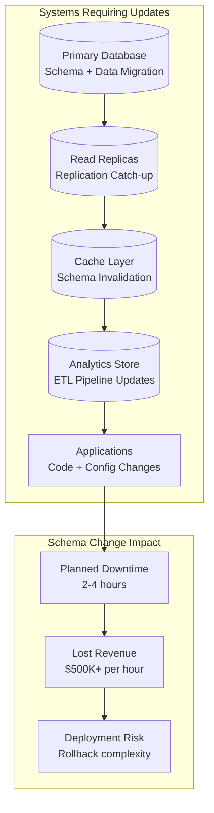

# Apache Ignite 3 Architecture Series: Part 3 — Schema Evolution Under Operational Pressure: When Downtime Isn't an Option

Schema changes in traditional databases mean downtime, lost revenue, and deployment chaos across multiple systems. This piece demonstrates how Apache Ignite's flexible schema approach helps lets data model evolve at the pace of your business requirements.

<!-- truncate -->

Your high-velocity application runs 24/7. Customer expectations don't pause for maintenance windows. Functional requirements evolve continuously. Yet traditional database schema changes require downtime, coordination across teams, and careful rollback planning.

Consider a payment processing system handling peak loads of 50,000 transactions per second. A new compliance rule requires additional fraud-detection fields. Traditional schema changes would require:

- **Coordinate downtime** across payment processing, fraud detection, and reporting systems
- **Apply schema changes** to primary database, read replicas, and cache layers
- **Deploy application updates** that work with new schema
- **Validate data consistency** across all systems

**Total downtime**: 2-4 hours. **Lost revenue**: $500K+ for a payment processor.

Apache Ignite 3 eliminates this constraint through flexible schema evolution. Schema changes apply without downtime, applications adjust automatically, and system operations continue uninterrupted.

**The result: operational evolution without operational interruption.**

---

_Part 3 of 8 in the Apache Ignite 3 Architecture Series_

---

## The Schema Rigidity Problem at Scale

### Traditional Schema Change Overhead

High-velocity applications face schema evolution challenges that compound with scale:

**Multi-System Schema Coordination:**



**The Compound Effect:**

- Each system adds coordination complexity
- Rollback procedures multiply with system count
- Testing requires full integration validation
- Deployment windows must accommodate slowest system

### Real-World Schema Evolution Pressure

**E-commerce Platform Evolution** (peak traffic: 100,000 orders per second):

**Month 1**: Basic order processing

```sql
CREATE TABLE orders (
    order_id BIGINT PRIMARY KEY,
    customer_id BIGINT,
    product_id BIGINT,
    amount DECIMAL(10,2),
    status VARCHAR(20)
);
```

**Month 6**: Add payment processing compliance

```sql
-- Traditional approach: downtime required
ALTER TABLE orders ADD COLUMN payment_method VARCHAR(50);
ALTER TABLE orders ADD COLUMN payment_processor VARCHAR(30);
ALTER TABLE orders ADD COLUMN compliance_data VARCHAR(500);
-- Requires: 2-hour maintenance window
-- Impact: $200K lost sales during downtime
```

**Month 12**: International expansion requirements

```sql
-- More complexity: multiple system coordination
ALTER TABLE orders ADD COLUMN currency_code CHAR(3);
ALTER TABLE orders ADD COLUMN exchange_rate DECIMAL(10,6);
ALTER TABLE orders ADD COLUMN tax_jurisdiction VARCHAR(50);
ALTER TABLE orders ADD COLUMN shipping_region VARCHAR(50);
-- Requires: 4-hour coordinated deployment
-- Impact: $800K lost sales, customer complaints
```

**The Pattern**: Each functional change requires operational disruption that grows with system complexity.

---

## Apache Ignite Flexible Schema Architecture

### Catalog-Driven Schema Management

Apache Ignite manages schema evolution through versioned metadata catalogs that coordinate changes across distributed nodes using hybrid logical clocks for timestamp ordering:

**Schema Evolution Process:**

- **Validation Phase**: New columns validated against existing schema
- **Atomic Update**: Schema change applied as single `NewColumnsEntry` operation
- **Version Management**: Applications operate against appropriate schema version
- **Cluster Coordination**: HybridTimestamp ensures consistent activation

**Key Advantages:**

- **Atomic Updates**: Schema changes apply as single operations
- **Version Management**: Applications can operate against different schema versions
- **Validation**: Automatic conflict detection and resolution
- **Rollback**: Schema changes are reversible without data loss

### Time-Based Schema Consistency

Schema changes coordinate across distributed nodes using cluster-wide timestamps:

**Consistency Guarantees:**

- **Point-in-Time Activation**: All nodes apply schema changes simultaneously
- **Transaction Safety**: In-flight operations complete with original schema
- **Application Compatibility**: Gradual adoption without breaking changes

The catalog management system uses `HybridTimestamp` values to ensure schema versions activate consistently across all cluster nodes, preventing race conditions and maintaining data integrity during schema evolution.

---

## Schema Evolution in Production

### Adding Fraud Detection Fields (Real-Time)

**Business Requirement**: New fraud detection requires additional order data fields.

**Traditional Approach**:

```sql
-- Requires 2-hour maintenance window
BEGIN;
  ALTER TABLE orders ADD COLUMN fraud_score DECIMAL(5,2);
  ALTER TABLE orders ADD COLUMN risk_factors VARCHAR(500);
  ALTER TABLE orders ADD COLUMN verification_status VARCHAR(30);
COMMIT;
-- Update application code (coordinated deployment)
-- Update cache schemas (cache invalidation)
-- Update analytics pipelines (ETL modifications)
-- Test end-to-end integration
```

**Apache Ignite Approach**:

```java
// Schema evolution during live operations
try (IgniteClient client = IgniteClient.builder().addresses("cluster:10800").build()) {
    // Add fraud detection columns without downtime
    client.sql().execute(null, """
        ALTER TABLE orders ADD COLUMN (
            fraud_score DECIMAL(5,2) DEFAULT 0.0,
            risk_factors VARCHAR(500) DEFAULT '',
            verification_status VARCHAR(30) DEFAULT 'PENDING'
        )
    """);

    // Applications immediately see new schema
    // Existing queries continue working
    // New functionality can use additional fields
}
// Application code adapts automatically
client.transactions().runInTransaction(tx -> {
    // Existing order processing continues
    client.sql().execute(tx, "INSERT INTO orders (order_id, customer_id, amount) VALUES (?, ?, ?)",
                        orderId, customerId, amount);

    // New fraud detection can use additional fields when ready
    if (fraudDetectionEnabled) {
        client.sql().execute(tx, "UPDATE orders SET fraud_score = ?, risk_factors = ? WHERE order_id = ?",
                           fraudScore, riskFactors, orderId);
    }
});
```

**Result**:

- **Downtime**: Zero
- **Deployment coordination**: None required
- **Revenue impact**: Zero
- **Time to production**: Minutes instead of hours

### Unified Schema Access Across APIs

**Here's how the evolved schema works seamlessly across different access patterns:**

```java
// The SAME evolved schema accessible through all APIs immediately
Table ordersTable = client.tables().table("orders");
// 1. Key-value access automatically sees new schema
Tuple orderTuple = ordersTable.keyValueView()
    .get(tx, Tuple.create().set("order_id", orderId));
// New fields available: orderTuple.stringValue("verification_status")
// 2. SQL access uses new fraud detection fields immediately
ResultSet<SqlRow> suspiciousOrders = client.sql().execute(tx,
    "SELECT order_id, fraud_score, risk_factors " +
    "FROM orders WHERE fraud_score > 0.8 AND verification_status = 'REVIEW'");
// 3. Record access handles new fields through schema evolution
OrderRecord record = ordersTable.recordView()
    .get(tx, new OrderRecord(orderId));
// OrderRecord.fraudScore now available without code changes
```

**Schema Evolution Benefits:**

- **No API fragmentation**: Same schema changes work across key-value, SQL, and record APIs
- **No deployment coordination**: All access patterns see schema changes immediately
- **No data migration**: New fields populate automatically with defaults
- **No downtime**: Live applications continue operating during schema evolution

**The unified schema advantage**: Schema changes apply once and work immediately across all data access patterns, eliminating the multi-system coordination that creates downtime.

### International Expansion Schema Evolution

**Business Requirement**: Support multiple currencies and tax jurisdictions.

```java
// Progressive schema evolution for international expansion
public class InternationalExpansionEvolution {

    public void addCurrencySupport(IgniteClient client) {
        // Phase 1: Add currency fields (no downtime)
        client.sql().execute(null, """
            ALTER TABLE orders ADD COLUMN (
                currency_code CHAR(3) DEFAULT 'USD',
                exchange_rate DECIMAL(10,6) DEFAULT 1.0,
                base_amount DECIMAL(10,2)
            )
        """);

        // Applications continue working with existing USD logic
        // New international orders can specify currency
    }

    public void addTaxSupport(IgniteClient client) {
        // Phase 2: Add tax jurisdiction fields (no downtime)
        client.sql().execute(null, """
            ALTER TABLE orders ADD COLUMN (
                tax_jurisdiction VARCHAR(50) DEFAULT 'US-FEDERAL',
                tax_rate DECIMAL(5,4) DEFAULT 0.0875,
                tax_amount DECIMAL(10,2) DEFAULT 0.0
            )
        """);

        // Tax calculations adapt automatically
    }

    public void addShippingSupport(IgniteClient client) {
        // Phase 3: Add regional shipping (no downtime)
        client.sql().execute(null, """
            ALTER TABLE orders ADD COLUMN (
                shipping_region VARCHAR(50) DEFAULT 'DOMESTIC',
                customs_data VARCHAR(500),
                estimated_delivery_days INT DEFAULT 3
            )
        """);
    }
}
```

**Business Benefits:**

- **Continuous Deployment**: Feature releases independent of schema changes
- **A/B Testing**: Test international features with subset of traffic
- **Risk Reduction**: Gradual rollout instead of big-bang deployment
- **Revenue Protection**: No downtime for existing operations

---

## Schema Evolution Performance Impact

### Traditional Schema Change Performance Cost

**Large Table Schema Changes** (100M+ records):

```sql
-- Traditional ALTER TABLE on 100M records
ALTER TABLE orders ADD COLUMN fraud_score DECIMAL(5,2);
-- Performance impact:
-- - Table lock: 30-60 minutes
-- - I/O overhead: Rewrite entire table
-- - Replication lag: Hours to catch up
-- - Application unavailability: Complete downtime
```

**Cost Analysis:**

- **Revenue loss**: $500K-$2M per hour of downtime
- **Customer impact**: Service unavailable during business hours
- **Engineering cost**: 20+ engineer hours for coordination
- **Risk**: Single point of failure for rollback

### Apache Ignite Schema Evolution Performance

**Zero-Downtime Schema Changes** (100M+ records):

Apache Ignite's catalog-based approach enables rapid schema changes by updating metadata rather than restructuring data:

**Performance Characteristics:**

- **Schema change time**: Fast metadata operations (typically under 100ms)
- **Application downtime**: Zero
- **Throughput impact**: Minimal during change operation
- **Recovery time**: Immediate (no recovery needed)

Performance improves by separating schema metadata management from data storage, allowing schema evolution without touching existing data structures.

---

## Business Impact of Schema Flexibility

### Revenue Protection

**E-commerce Platform Example** (processing $10M/month):

**Traditional Approach:**

- 4 schema changes per year × 3 hours downtime = 12 hours total downtime
- Revenue impact: $10M/month ÷ 730 hours/month × 12 hours = $164K lost annually
- Engineering overhead: 80 hours coordination × $150/hour = $12K annually
- **Total cost**: $176K annually

**Apache Ignite Approach:**

- 4 schema changes per year × 0 hours downtime = 0 hours total downtime
- Revenue impact: $0 lost
- Engineering overhead: 4 hours × $150/hour = $600 annually
- **Total cost**: $600 annually

**Annual savings**: $175K+ (99.7% reduction)

### Development Velocity Impact

**Feature Development Acceleration:**

```java
// Traditional: Schema change blocks feature development
public class TraditionalFeatureDevelopment {
    // Week 1-2: Plan schema changes across systems
    // Week 3-4: Coordinate deployment windows
    // Week 5: Execute schema changes during downtime
    // Week 6-8: Deploy application changes
    // Week 9: Validate integration across systems

    // Total: 9 weeks from idea to production
}
// Apache Ignite: Schema and features evolve together
public class FlexibleFeatureDevelopment {
    public void developFeatureWithSchemaEvolution() {
        // Day 1: Add required schema fields
        client.sql().execute(null, "ALTER TABLE customers ADD COLUMN loyalty_tier VARCHAR(20) DEFAULT 'STANDARD'");

        // Day 1-3: Implement feature logic
        // Day 4: Deploy to production (no coordination needed)
        // Day 5: Monitor and iterate

        // Total: 1 week from idea to production
    }
}
```

**Impact**: 9x faster feature delivery through schema flexibility.

### Competitive Advantage Through Agility

**Market Response Speed:**

- **Regulatory compliance**: Adapt to new requirements within hours
- **Customer feedback**: Implement requested features without deployment delays
- **Competitive pressure**: Launch counter-features without schema coordination overhead

**Innovation Capability:**

- **A/B testing**: Try schema variations without impacting production
- **Experimentation**: Add telemetry fields for new insights
- **Personalization**: Evolve customer data models based on behavior patterns

---

## The Operational Evolution Advantage

Traditional databases force trade-offs between schema stability and operational agility. Apache Ignite eliminates this trade-off through flexible schema evolution that supports both operational stability and rapid functional expansion.

**The principle**: Your schema should evolve as fast as your business requirements.

When market demands shift daily but schema changes occur only during monthly maintenance windows, the architecture becomes the bottleneck to feature delivery. Flexible schema evolution ensures the data model advances with business needs rather than restricting them.

Fast-paced applications can't afford architectural constraints that slow adaptation. Schema flexibility becomes a strategic advantage when your system must evolve faster than competitors can deploy.

---

_Next: Part 4 explores how integrated platform performance maintains consistency across all workload types. This ensures that schema flexibility and business agility don't compromise the performance characteristics your application requires._
