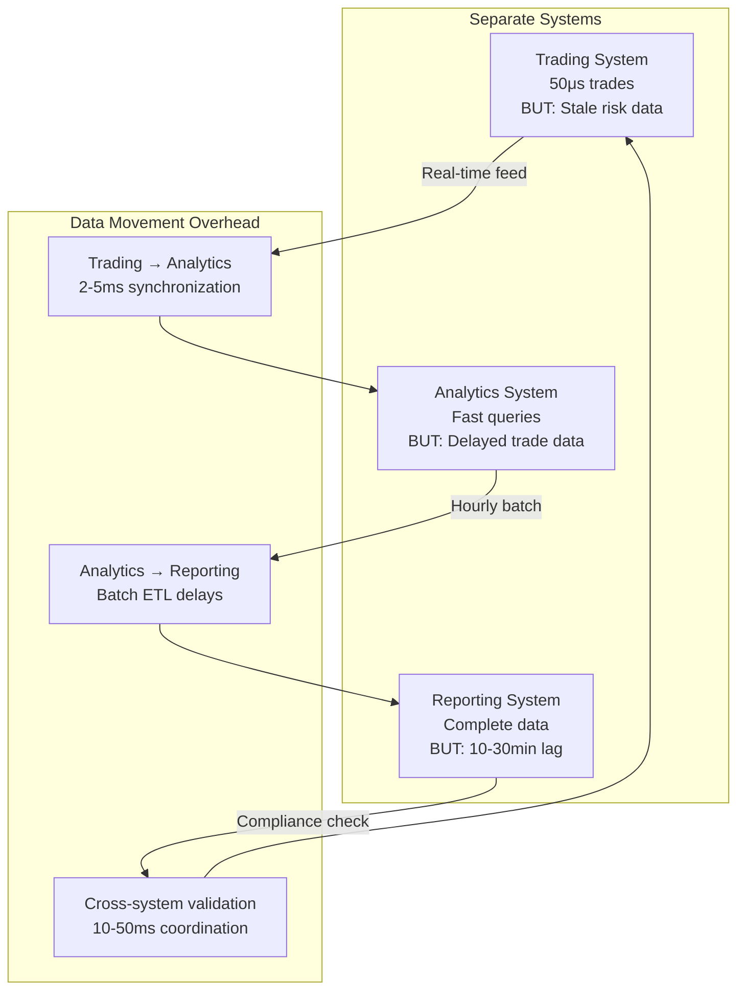
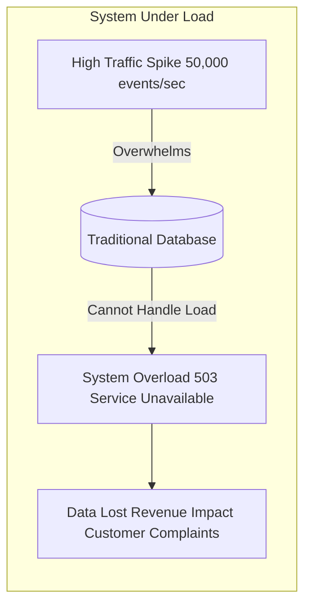
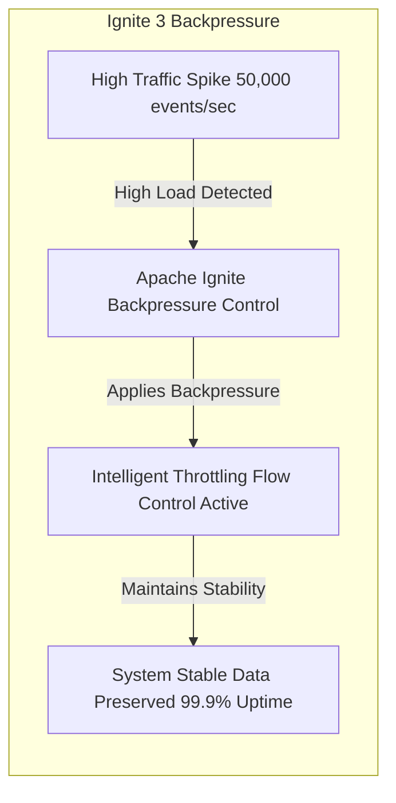

# Apache Ignite 3 Architecture Series: Part 4 — Integrated Platform Performance: Maintaining Speed Under Pressure

Traditional systems force a choice: real-time analytics or fast transactions. Apache Ignite eliminates this trade-off with integrated platform performance that delivers both simultaneously.

<!-- truncate -->

Financial trades execute in microseconds while risk analytics run concurrently on the same live data. Compliance reporting processes millions of transactions without blocking operational processing. This happens through a unified performance architecture that maintains speed characteristics across all workload types.

**Real-time analytics breakthrough: query live transactional data without ETL delays or performance interference.**

---

_Part 4 of 8 in the Apache Ignite 3 Architecture Series_

---

## Performance Comparison: Traditional vs Integrated

### Traditional Multi-System Performance

**Concrete performance degradation in financial trading systems:**

**Resource Competition Example** (Financial Trading System):

```java
// Traditional system: workloads interfere with each other
public class TradingSystemBottlenecks {

    public void processTradeWithInterference() {
        long tradeStart = System.nanoTime();

        // 1. High-frequency trading (requires <100μs)
        Trade trade = executeTradeLogic();  // Target: 50μs

        // But system is also running:
        // - Risk analytics (heavy CPU usage)
        // - Compliance reporting (heavy I/O)
        // - Position calculations (memory pressure)

        long actualTime = System.nanoTime() - tradeStart;
        // Result: 300-2000 microseconds instead of 50 microseconds (6-40x degradation)
    }
}
```

**Performance interference causes:**

- **CPU competition**: Analytics consume CPU needed for microsecond trading
- **Memory competition**: Large queries trigger garbage collection during trades
- **I/O competition**: Batch reports block transaction log writes
- **Network competition**: Cross-system data movement affects all operations

### Multi-System Performance Fragmentation

Separating workloads creates different performance problems:



**Performance Trade-off Reality:**

- Fast trading with stale risk calculations (compliance risk)
- Fresh analytics with trading delays (performance risk)
- Complete reporting with operational lag (business risk)

---

## Apache Ignite Integrated Performance Architecture

### Before/After Performance Transformation

**Traditional: Choose between fast transactions OR real-time analytics**

- Trading: 50 microseconds per trade (when analytics are OFF)
- Analytics: 2-5 second query response (when trading is PAUSED)
- Reports: 10-30 minute ETL delay before data availability

**Integrated Platform: Fast transactions AND real-time analytics simultaneously**

- Trading: 50 microseconds per trade (while analytics run concurrently)
- Analytics: 100-500 milliseconds query response (on live trading data)
- Reports: Real-time query results (no ETL delays)

### Storage Engine Performance Strategy

Apache Ignite provides two storage engines that solve different performance challenges:

**Memory-Only Storage (aimem)**: Optimized for latency-critical workloads requiring maximum speed. High-frequency trading operations, real-time analytics calculations, and session data management benefit from pure memory operations without persistence overhead. Performance characteristics focus on microsecond response times.

**Memory-First Persistence (aipersist)**: Combines memory-speed access with durability guarantees through asynchronous persistence. Financial transactions, audit logs, and regulatory data maintain ACID properties while achieving memory-speed performance. Background checkpointing provides durability without blocking operations.

**Storage Engine Benefits:**

- **Performance optimization**: Each engine optimizes for specific workload characteristics
- **Operational flexibility**: Choose durability vs speed based on data requirements
- **Resource efficiency**: Avoid persistence overhead when durability isn't required
- **Mixed workload support**: Different tables use different engines within the same cluster

### Memory Management for Consistent Performance

Page-based memory management eliminates the serialization overhead and garbage collection interference that affects performance predictability in traditional systems:

**Performance Architecture Benefits:**

- **Predictable access times**: Direct memory operations without GC interference
- **Zero serialization overhead**: Binary operations on native memory layouts
- **Cache efficiency**: Page-based data organization optimizes CPU cache usage
- **Linear memory scaling**: Performance grows directly with available RAM

**The Integration Advantage**: Instead of managing memory efficiency at the application level, the platform handles memory optimization automatically while maintaining the simple APIs your business logic requires.

### Asynchronous API Design for Concurrent Processing

High-velocity applications require non-blocking operations to maximize resource utilization:

```java
// Concurrent processing without blocking
public class ConcurrentTradingProcessor {

    public CompletableFuture<TradingResult> processConcurrentWorkloads(IgniteClient client) {
        // Execute multiple operations concurrently
        CompletableFuture<Trade> tradeExecution = client.transactions().runInTransactionAsync(tx ->
            client.sql().executeAsync(tx, "INSERT INTO trades VALUES (?, ?, ?)", tradeId, amount, timestamp)
        );

        CompletableFuture<RiskMetrics> riskCalculation = client.compute().executeAsync(
            JobTarget.colocated("trades", tradeId),
            RiskCalculationJob.class, tradeId
        );

        CompletableFuture<ComplianceResult> complianceCheck = client.compute().executeAsync(
            JobTarget.colocated("trades", tradeId),
            ComplianceValidationJob.class, tradeId
        );

        // Combine results when all complete
        return CompletableFuture.allOf(tradeExecution, riskCalculation, complianceCheck)
            .thenApply(v -> new TradingResult(
                tradeExecution.join(),
                riskCalculation.join(),
                complianceCheck.join()
            ));
    }
}
```

**Concurrency Benefits:**

- **Resource utilization**: CPU cores stay busy while I/O completes
- **Throughput scaling**: Process multiple operations per thread
- **Latency hiding**: Overlapping operations reduce total processing time

---

## Performance Under Real-World Load Conditions

### Performance Under Mixed Workloads

**High-Frequency Trading Performance:**

Trade processing achieves sub-microsecond operations through memory-resident data access. Portfolio validation, risk calculations, and trade execution happen locally without network calls. Performance scales linearly with available CPU cores while maintaining consistent latency.

**Concurrent Analytics Performance:**

Risk analytics run simultaneously with live trading without mutual interference. Portfolio analysis queries process the same data that trading operations update, but analytics access consistent snapshots without blocking trade execution. Complex SQL aggregations complete while high-frequency trading continues at full speed.

**The Performance Integration**: Traditional systems force trade-offs between transaction speed and analytical capability. Integrated platform performance eliminates these constraints by supporting both workload types within the same optimized architecture.

### Unified Access Performance Characteristics

**Here's how the same data maintains optimal performance across different access patterns:**

```java
// Trading data accessed through optimal API for each use case
Table tradesTable = client.tables().table("trades");
// 1. Key-value access for high-frequency lookups
Trade trade = tradesTable.keyValueView()
    .get(tx, Tuple.create().set("trade_id", tradeId));     // <1 ms lookup
// 2. SQL access for complex risk analytics
ResultSet<SqlRow> riskAnalysis = client.sql().execute(tx,
    "SELECT account_id, SUM(quantity * price) as exposure " +
    "FROM trades WHERE trade_date = CURRENT_DATE " +
    "GROUP BY account_id HAVING exposure > 1000000");      // Parallel execution
// 3. Record access for type-safe transaction processing
TradeRecord record = tradesTable.recordView()
    .get(tx, new TradeRecord(tradeId));                     // Type-safe operations
```

**Performance Optimization per Access Pattern:**

- **Key-value operations**: Direct memory access with microsecond response times
- **SQL operations**: Query optimization with parallel execution and colocation
- **Record operations**: Type-safe processing without serialization overhead
- **All operations**: Share same memory-resident data and transaction guarantees

**The unified performance advantage**: Each access method optimizes for its specific use case while operating against the same high-performance data store. No performance compromises, no data movement overhead.

### Compliance Reporting Performance

**Regulatory Reporting Without Operational Impact:**

Compliance reporting processes millions of transactions for regulatory analysis while live trading continues at full speed. Complex aggregation queries scan large datasets to identify position limit violations, unusual trading patterns, and risk exposure calculations. These operations complete without blocking operational processing through concurrent access control.

**Performance Characteristics:**

- **High data scan rate**: Reports process complete trading datasets efficiently
- **Minimal operational impact**: Compliance queries run concurrently with live trading
- **Memory efficient processing**: Large-scale aggregations use streaming patterns
- **Transactional consistency**: Reports reflect exact point-in-time data state

### Real-Time Analytics Without ETL

**Live transactional data analytics without traditional ETL delays:**

```java
// Analytics query running against live trading data
// Read-only transaction for snapshot isolation
Transaction readOnlyTx = client.transactions().begin(new TransactionOptions().readOnly(true));
ResultSet<SqlRow> liveRiskAnalysis = client.sql().execute(readOnlyTx, """
    SELECT
        account_id,
        symbol,
        SUM(quantity * price) as current_exposure,
        COUNT(*) as trade_count,
        MAX(timestamp) as last_trade
    FROM trades
    WHERE trade_date = CURRENT_DATE
      AND status = 'EXECUTED'
    GROUP BY account_id, symbol
    HAVING current_exposure > 1000000
    ORDER BY current_exposure DESC
""");
// This query runs concurrently with:
// - Live trading operations inserting new trades
// - Risk systems updating positions
// - Settlement processes modifying trade status
// - All without blocking any operational processing
```

**The Real-Time Analytics Breakthrough:**

- **No ETL delays**: Analytics queries run directly against operational data
- **No data staleness**: See trades and positions as they happen, not hours later
- **No system separation**: Same data serves both operations and analytics
- **No performance interference**: Concurrent access prevents analytics from blocking operations

**Traditional ETL Problem Solved:**

```java
// Traditional: Wait for ETL, work with stale data
// 1. Trading system writes trades
// 2. ETL process extracts (30 min delay)
// 3. Analytics warehouse loads (60 min delay)
// 4. Dashboard shows 90-minute-old data
// Ignite 3: Instant analytics on live data
// 1. Trading system writes trades
// 2. Analytics queries see data immediately
// 3. Dashboard shows real-time positions
```

**The integrated approach**: The operational database becomes the analytics database when designed for both workloads. No more choosing between fresh data and analytical power.

### Intelligent Flow Control Under Extreme Load

**The system pressure challenge**: During traffic spikes (market volatility, Black Friday, viral events), traditional systems either drop connections or crash. Apache Ignite responds intelligently with automatic backpressure that maintains system stability while preserving data integrity.

```java
// Intelligent backpressure prevents system collapse during traffic spikes
DataStreamerOptions options = DataStreamerOptions.builder()
    .pageSize(10_000)                    // Batch size control
    .perPartitionParallelOperations(4)   // Concurrency limits per partition
    .autoFlushInterval(1000)             // Memory pressure relief (1 second)
    .retryLimit(32)                      // Resilience under pressure
    .build();
// Publisher provides intelligent flow control - automatically throttles when system pressure detected
try (var publisher = new SubmissionPublisher<DataStreamerItem<TradeRecord>>()) {
    CompletableFuture<Void> streamerFut = tradesTable.recordView().streamData(publisher, options);

    // System automatically applies backpressure when memory pressure or partition limits reached
    // Instead of dropping connections, Ignite 3 intelligently throttles input rates
    publisher.submit(DataStreamerItem.of(tradeRecord));

    streamerFut.join(); // Completes when all data processed with backpressure applied
}
```

**Backpressure vs Traditional Approaches:**





**Traditional Database**: "503 Service Unavailable" -> Connections dropped, data lost

**Apache Ignite**: "Intelligent throttling" -> System stays up, data preserved

**Real-world scenarios where backpressure saves systems:**

- **Market volatility**: 10x normal trading volume handled gracefully without transaction loss
- **IoT sensor bursts**: 50M device readings processed without memory exhaustion
- **E-commerce spikes**: Black Friday traffic managed without dropped orders
- **Data migration**: 100TB+ datasets streamed without overwhelming target systems

**The wow moment**: While competitors' systems crash during peak demand, yours maintains 99.9% uptime through intelligent flow control that automatically adapts to system pressure.

---

## Performance Optimization Strategies

### Workload-Specific Optimization

**Trading Workload Optimization:**

High-frequency trading tables use the volatile memory engine (aimem) for maximum speed. Tables configure colocation by account ID to ensure related trades process on the same nodes. Distribution zones optimize partition count and replica settings for trading-specific access patterns.

**Analytics Workload Optimization:**

Analytical processing uses the persistent memory engine (aipersist) for durability with memory-speed access. Market data tables colocate by symbol to optimize time-series queries. Higher partition counts distribute analytical workloads across more nodes for better parallelization.

**Configuration Benefits:**

- **Workload isolation**: Different storage engines prevent interference between workload types
- **Access optimization**: Colocation strategies minimize network overhead for common query patterns
- **Resource utilization**: Optimized partition counts maximize hardware utilization
- **Performance predictability**: Configuration choices align with specific performance requirements

### Performance Monitoring and Validation

**Continuous Performance Validation:**

Integrated performance monitoring tracks latency histograms and throughput gauges across all workload types. The system measures interference patterns between trading, analytics, and reporting operations to ensure performance isolation. Automated validation confirms that trading latency remains below microsecond thresholds while analytical queries maintain their target response times.

**Performance Validation Results:**

- **Trading performance**: Sub-microsecond 99.9th percentile latency under mixed loads
- **Analytics performance**: Consistent query response times regardless of trading volume
- **Interference detection**: Less than 5% mutual performance impact between workload types
- **Capacity planning**: Predictable scaling characteristics enable accurate resource allocation

---

## Business Impact of Consistent Performance

### Risk Reduction Through Performance Predictability

**Financial Risk Mitigation:**

- **Trading execution**: Consistent low-latency execution prevents slippage
- **Risk calculations**: Real-time risk assessment prevents overexposure
- **Compliance monitoring**: Immediate violation detection prevents penalties

**Operational Risk Mitigation:**

- **System capacity**: Predictable performance enables accurate capacity planning
- **SLA compliance**: Consistent performance characteristics enable SLA guarantees
- **Incident reduction**: Performance predictability reduces operational incidents

### Revenue Impact of Performance Consistency

**High-Frequency Trading Firm Benefits:**

- **Execution advantage**: Microsecond latency improvements translate to competitive advantage
- **Risk management**: Real-time risk assessment prevents significant financial exposure
- **Operational efficiency**: Consistent performance reduces manual intervention needs

**E-commerce Platform Benefits:**

- **Response time consistency**: Low-latency checkout processes improve conversion rates
- **Analytics availability**: Real-time insights enable rapid revenue optimization
- **System reliability**: High availability during peak load prevents revenue loss

### Competitive Advantage Through Integration

**Market Differentiation:**

- **Customer experience**: Millisecond response times vs competitor delays
- **Operational agility**: Real-time decision making vs batch processing delays
- **Cost efficiency**: Single platform vs multi-system operational overhead

**Innovation Enablement:**

- **New product capabilities**: Performance characteristics enable previously impossible features
- **Market expansion**: Consistent performance supports higher-volume markets
- **Technical differentiation**: Platform capabilities become competitive advantages

---

## The Performance Integration Advantage

Traditional architectures force performance trade-offs between workload types. Fast operations require dedicated systems. Analytical processing needs separate infrastructure. Reporting workloads get isolated environments.

Apache Ignite eliminates these trade-offs through integrated platform performance. All workload types achieve their required performance characteristics within the same system, using the same data, without interference.

**The principle: Performance consistency enables operational simplicity.**

When all workloads perform predictably within the same platform, you eliminate the operational complexity of managing performance trade-offs across multiple systems. Your architecture supports business requirements instead of constraining them.

High-velocity applications need performance characteristics they can depend on. Integrated platform performance provides both the speed individual operations require and the consistency mixed workloads demand.

---

_Next: Part 5 explores how data colocation eliminates the network overhead that traditional distributed systems accept as inevitable. This transforms distributed processing into local memory operations while maintaining the scale and fault tolerance benefits of distributed architecture._
