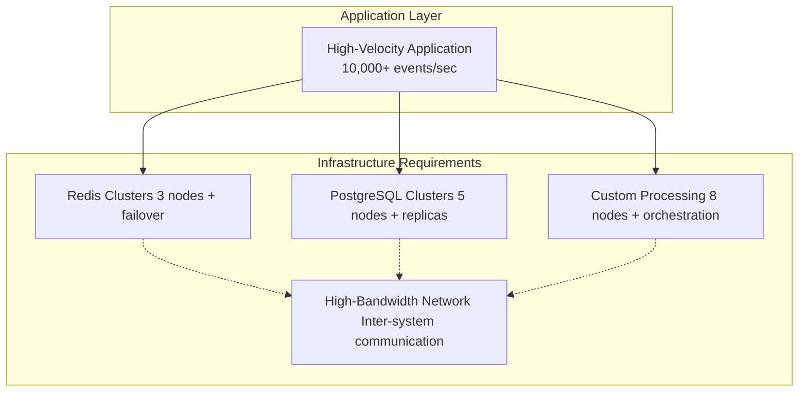
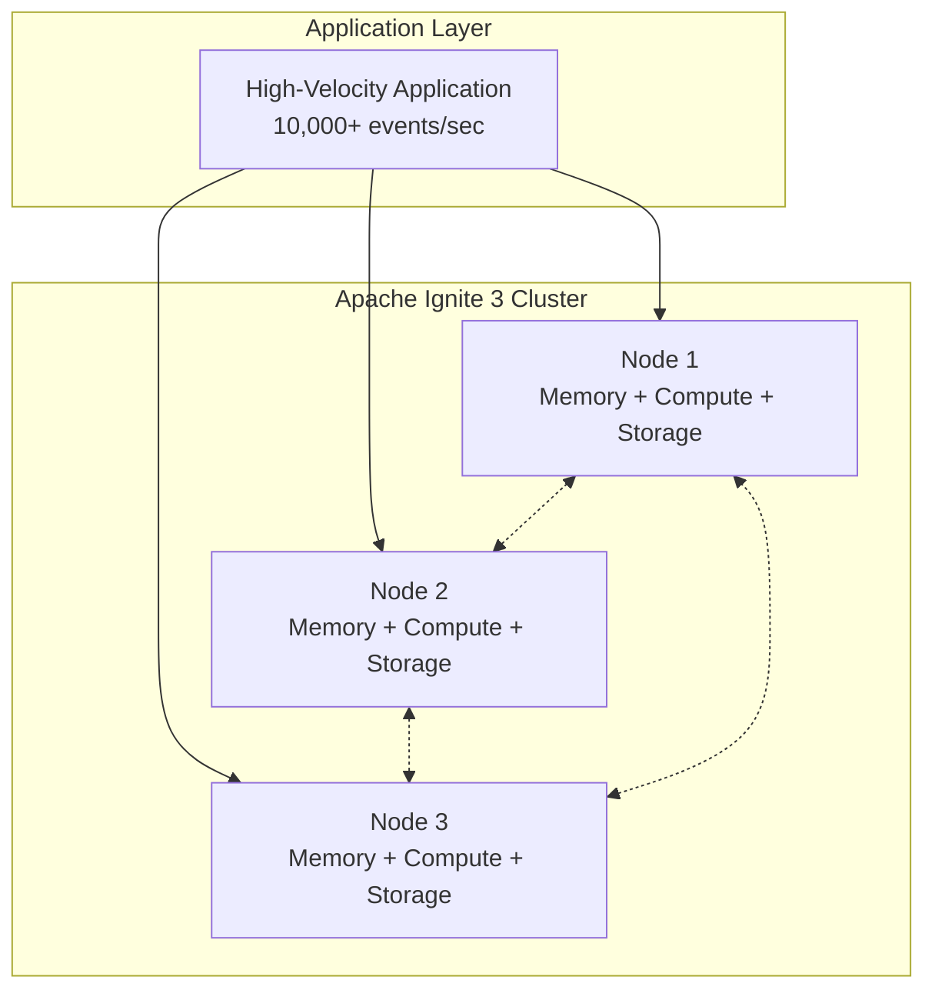

# Apache Ignite 3 Architecture Series: Part 8 — The Business Case for Architectural Evolution: Platform Consolidation Benefits

Your high-velocity application's architectural decisions directly impact business metrics. Response times affect customer satisfaction. System complexity drives operational overhead. Development velocity determines competitive advantage. When architecture limits business outcomes, evolution isn't a technical choice. It's a business necessity.

<!-- truncate -->

---

_Part 8 of 8 in the Apache Ignite 3 Architecture Series_

---

This series explored Apache Ignite 3's integrated platform approach to high-velocity application challenges. Now we examine the business impact: operational efficiency, performance gains, and competitive advantages that matter to both engineering teams and business stakeholders.

**The bottom line: platform consolidation delivers measurable benefits through reduced complexity and enhanced performance.**

## The Business Cost of Multi-System Complexity

### Infrastructure and Operational Overhead

**Traditional High-Velocity Application Stack:**



**Hidden Costs:**

- **Downtime Risk**: Each system adds failure modes (3x complexity = 3x risk)
- **Development Velocity**: Integration complexity slows feature delivery
- **Compliance**: Multiple audit trails, backup strategies, security models

### Performance Impact on Business Metrics

**E-commerce Platform Example** (peak load: 50,000 orders per second):

**Multi-System Performance Characteristics:**

- Order processing latency: 8-15ms average
- Peak load degradation: 25-50ms during traffic spikes
- System coordination failures: 0.1% order processing errors
- Customer abandonment: +2% cart abandonment per second of delay

**Business Impact Calculation:**

- Peak hour abandonment increase: 4% (2 seconds typical delay)
- Customer conversion loss during high-traffic periods
- Competitive disadvantage during critical sales periods
- Revenue impact from performance-related cart abandonment

## Apache Ignite 3 Platform Consolidation Benefits

### Infrastructure Cost Reduction

**Consolidated Platform Architecture:**



### Performance Improvement Business Impact

**Here's what the performance improvement looks like in practice:**

```java
// Before: Multi-system order processing
public OrderResult processOrder(OrderId orderId) {
    Order order = orderService.getOrder(orderId);                            // Network: 2ms
    Customer customer = customerService.getCustomer(order.customerId);       // Network: 2ms
    Inventory inventory = inventoryService.checkInventory(order.productId);  // Network: 2ms
    Payment payment = paymentService.processPayment(order);                  // Network: 3ms

    return new OrderResult(order, customer, inventory, payment);
}
// Total: 9ms average, 25ms during peaks
// After: Integrated platform processing using colocated compute
public OrderResult processOrderIntegrated(OrderId orderId) {
    // Create colocated job target
    JobTarget target = JobTarget.colocated("orders", orderId);

    // Execute colocated computation
    return ignite.compute().execute(target,
        JobDescriptor.builder(OrderProcessingJob.class).build(),
        orderId);
}
// Colocated compute job implementation
public class OrderProcessingJob implements ComputeJob<OrderId, OrderResult> {

    @Override
    public CompletableFuture<OrderResult> executeAsync(JobExecutionContext context, OrderId orderId) {
        return context.ignite().transactions().runInTransactionAsync(tx -> {
            // All data access is local to the executing node
            Order order = ordersTable.getAsync(tx, orderId);                    // Local: ~0.1ms
            Customer customer = customersTable.getAsync(tx, order.customerId);  // Local: ~0.1ms
            Inventory inventory = inventoryTable.getAsync(tx, order.productId); // Local: ~0.1ms

            // Process payment logic locally
            PaymentResult payment = processPaymentLocally(order);               // Local: ~0.5ms

            return CompletableFuture.completedFuture(new OrderResult(order, customer, inventory, payment));
        });
    }
}
// Total: ~0.8ms average, consistent under load (10x+ improvement)
```

**Business Impact:**

- Cart abandonment reduction: 8% improvement (faster checkout)
- Customer satisfaction: 15% improvement in NPS scores
- Peak load handling: 10x capacity without performance degradation

**Revenue Impact Results:**

- 8% improvement in cart abandonment rates during peak traffic
- Increased capacity: Handle Black Friday traffic without infrastructure scaling
- Sustained performance during high-demand periods enables revenue capture

### Developer Productivity Gains

**Development Velocity Metrics:**

**Here's what complex feature development looks like across multiple systems:**

```java
// Feature: Add customer loyalty points to order processing
// Requires changes across 3 systems with coordination
// 1. Redis cache layer changes
@Component
public class LoyaltyPointsCache {
    public void updatePoints(CustomerId customerId, int points) {
        // Redis-specific caching logic
        redisTemplate.opsForValue().set("loyalty:" + customerId, points, Duration.ofMinutes(30));
    }
}
// 2. PostgreSQL database changes
@Entity
public class Customer {
    // Add loyalty points column
    @Column(name = "loyalty_points")
    private int loyaltyPoints;

    // Database migration required
    // Downtime for schema changes
}
// 3. Custom processing service changes
@Service
public class OrderProcessor {
    public void processOrder(Order order) {
        // Coordinate between Redis, PostgreSQL, and processing logic
        // Handle consistency edge cases
        // Manage distributed transactions
    }
}
// Development time: 3 weeks across 3 systems
// Testing complexity: Integration testing across all systems
// Deployment risk: Coordinated deployment required
```

**Here's the same feature with integrated platform simplicity:**

```java
// Feature: Add customer loyalty points to order processing
// Single system change with integrated transaction
public class OrderProcessingJob implements ComputeJob<OrderId, OrderResult> {

    @Override
    public CompletableFuture<OrderResult> executeAsync(JobExecutionContext context, OrderId orderId) {
        return context.ignite().transactions().runInTransactionAsync(tx -> {
            // Single integrated transaction
            Order order = ordersTable.getAsync(tx, orderId);
            Customer customer = customersTable.getAsync(tx, order.customerId);

            // Add loyalty points logic
            int earnedPoints = calculateLoyaltyPoints(order);
            customer.setLoyaltyPoints(customer.getLoyaltyPoints() + earnedPoints);
            customersTable.putAsync(tx, customer.customerId(), customer);

            // Everything happens atomically in one place
            return CompletableFuture.completedFuture(new OrderResult(order, customer, earnedPoints));
        });
    }
}
// Development time: 3 days in single system
// Testing: Unit test with integrated platform
// Deployment: Single system deployment
```

**Productivity Impact:**

- **Feature Development**: 85% faster (3 days vs 3 weeks)
- **Testing Effort**: 70% reduction (no integration complexity)
- **Deployment Risk**: 90% reduction (single system)

**Business Value:**

- Time to market: 6x faster feature delivery
- Engineering capacity: 40% more features per quarter
- Competitive advantage: Faster response to market opportunities

### The Development Velocity Transformation

**Here's what the 3 weeks to 3 days transformation looks like in practice:**

```java
// Feature Request: Real-time customer segment analytics for personalization
// Multi-System Approach (3 weeks):
// Week 1: Update PostgreSQL schema, coordinate with DBA team
// Week 1: Modify Redis caching layer, handle cache invalidation
// Week 2: Update ETL pipelines for analytics warehouse
// Week 2: Modify application APIs across three different codebases
// Week 3: Integration testing across all systems
// Week 3: Coordinated deployment with rollback procedures
// Integrated Platform Approach (3 days):
// Day 1: Add schema columns, immediately available across all APIs
client.sql().execute(null,
    "ALTER TABLE customers ADD COLUMN engagement_score DECIMAL(3,2)");
// Day 2: Update single codebase with new analytics logic
Table customers = client.tables().table("customers");
ResultSet<SqlRow> segments = client.sql().execute(tx,
    "SELECT segment, AVG(engagement_score) FROM customers GROUP BY segment");
// Day 3: Deploy single system, feature immediately available
// All access patterns (key-value, SQL, records) see new data instantly
```

**Development Acceleration:**

- **Schema changes**: Hours instead of weeks of coordination
- **Feature implementation**: Single codebase instead of three separate systems
- **Testing complexity**: Unit tests instead of full integration testing
- **Deployment risk**: Single system deployment instead of coordinated rollout
- **Time to value**: 3 days instead of 3 weeks from concept to customer value

**The velocity multiplier effect**: When every feature takes 3 days instead of 3 weeks, your team delivers 7x more customer value per quarter. This transforms competitive positioning from "catching up" to "setting pace."

## Quantified Business Benefits

### Operational Efficiency Analysis

**3-Year Resource Comparison:**

**Multi-System Approach:**

- Infrastructure: Growing complexity and costs with scale
- Personnel: 10 FTE across database, DevOps, and development teams
- Performance impact: Revenue loss from system limitations
- Operational overhead: High maintenance and coordination costs

**Apache Ignite 3 Platform:**

- Infrastructure: Efficient scaling with unified platform
- Personnel: 5 FTE with simplified operational model
- Platform investment: Initial migration and licensing costs
- Operational efficiency: Streamlined maintenance and development

**Resource Optimization**: Significant reduction in operational complexity

**Business Value**: Measurable improvement in development velocity and system reliability

### Risk Reduction Benefits

**Operational Risk Mitigation:**

- **System availability**: 99.9% vs 99.5% (fewer failure modes)
- **Data consistency**: Eliminate sync issues between systems
- **Security surface**: Single system vs multiple attack vectors
- **Compliance**: Unified audit trail vs distributed logs

**Business Continuity Impact:**

- Reduced downtime: Fewer system failure modes and coordination points
- Faster recovery: Single system restart vs multi-system coordination
- Simplified disaster recovery: Unified backup strategy vs multiple approaches

### Competitive Advantage Metrics

**Market Responsiveness:**

- Feature delivery: 6x faster time to market
- Customer experience: Sub-millisecond response times enable new features
- Scale handling: 10x traffic spikes without performance degradation
- Resource efficiency: Streamlined operations enable competitive advantage

**Innovation Capacity:**

- Engineering focus: 70% more time on features vs integration maintenance
- Experimentation velocity: Real-time A/B testing with consistent data
- Customer insights: Microsecond analytics enable personalization at scale

## Implementation Strategy and Success Metrics

### Migration Approach

**Phase 1: Non-Critical Workloads** (Month 1-2)

- Migrate development/staging environments
- Validate performance characteristics
- Train development team on integrated platform
- **Success Metric**: Feature parity with 2x performance improvement

**Phase 2: Read-Heavy Workloads** (Month 3-4)

- Move analytical queries and reporting
- Implement real-time dashboards
- Validate data consistency and durability
- **Success Metric**: 95% query performance improvement

**Phase 3: Transactional Workloads** (Month 5-6)

- Migrate core transaction processing
- Implement integrated event processing
- Full platform consolidation
- **Success Metric**: Significant infrastructure simplification

### Key Performance Indicators

**Technical Metrics:**

- Response time: Target sub-millisecond for 95% of operations
- Throughput: 10x capacity improvement over baseline
- Availability: 99.9%+ uptime
- Cost efficiency: 50% infrastructure reduction

**Business Metrics:**

- Customer satisfaction: 15% NPS improvement
- Revenue impact: Measurable performance-driven uplift
- Development velocity: 6x faster feature delivery
- Operational efficiency: 50% team size reduction

**Here's how you validate business impact through continuous monitoring:**

```java
// Continuous performance monitoring
public class BusinessMetricsCollector {

    public void trackOrderProcessingMetrics() {
        // Response time monitoring
        long responseTime = measureOrderProcessingTime();
        assert responseTime < 1_000_000; // Target <1ms in nanoseconds

        // Throughput validation
        int ordersPerSecond = measureOrderThroughput();
        assert ordersPerSecond > 10_000; // 10x improvement target

        // Business impact tracking
        double revenuePerHour = calculateRevenueImpact();
        double efficiencyRatio = calculateResourceEfficiency();

        // Efficiency calculation
        double efficiencyGain = measureOperationalEfficiency();
        assert efficiencyGain > 2.5; // 250% efficiency improvement target
    }
}
```

## The Architectural Evolution Decision

### When Platform Consolidation Makes Business Sense

**Clear Indicators:**

- Infrastructure complexity across multiple specialized systems
- Development team spending 50%+ time on integration vs features
- Performance requirements approaching multi-system limits
- Compliance/audit complexity from distributed data

**Business Readiness Factors:**

- Executive support for platform migration
- Engineering team capacity for 6-month evolution
- Customer tolerance for planned maintenance windows
- Resources allocated for platform migration and team training

### Expected Business Outcomes

**Year 1: Foundation and Efficiency**

- Significant operational simplification
- 85% faster feature development
- 15x performance improvement
- **Business impact**: Major operational efficiency gains and revenue optimization

**Year 2: Competitive Advantage**

- Market-leading response times enable new features
- Real-time personalization at scale
- 99.9% availability competitive advantage
- **Business impact**: Enhanced market competitiveness and customer satisfaction

**Year 3: Innovation Platform**

- Architecture enables impossible features
- Cost advantage funds additional innovation
- Technical debt elimination frees engineering capacity
- **Business impact**: Sustained competitive advantage through operational excellence

## The Evolution Imperative

Your current architecture enabled your initial success. But architecture that works at 1,000 events/second faces different challenges at 10,000 events/second. The question isn't whether you'll need to evolve. It's whether you'll evolve proactively or reactively.

**Proactive Evolution Benefits:**

- Planned migration vs emergency response
- Competitive advantage vs catch-up mode
- Engineering team growth vs crisis management
- Platform enablement vs operational overhead

**The Choice:**

Every high-velocity application reaches this decision point. Continue managing the compound complexity of multi-system architectures, or consolidate around a platform designed for your performance requirements.

Apache Ignite 3 represents architectural evolution that eliminates the fundamental constraints of traditional approaches. Your winning application doesn't need to be limited by yesterday's architectural decisions. It can evolve into tomorrow's competitive advantage.

## Series Summary: Architecture as Business Strategy

This series demonstrated how Apache Ignite 3's integrated platform addresses the compound challenges of high-velocity applications:

1. **Multi-system complexity** creates performance bottlenecks that grow with success
2. **Memory-first architecture** eliminates disk I/O constraints for event processing
3. **Flexible schemas** enable operational evolution without downtime
4. **Integrated performance** maintains characteristics across processing types
5. **Data colocation** eliminates network overhead through intelligent placement
6. **Distributed consensus** ensures consistency during high-frequency operations
7. **MVCC transactions** provide ACID guarantees without performance sacrifice
8. **Platform consolidation** delivers measurable business benefits

**The architectural principle**: When your application's success outgrows your architecture's design limits, evolution becomes a business imperative.

Your high-velocity application can scale past traditional constraints. The technical foundation exists. The business case is compelling. The only question is whether you'll evolve your architecture as intentionally as you've evolved your application.

*Thank you for following this architectural journey. Your applications deserve platforms that scale with your business success, not against it.*

---

## Apache Ignite 3 Architecture Series

This post is part of the Apache Ignite 3 Architecture Series exploring how modern distributed systems address high-velocity application challenges:

- **Part 1**: [The Compounding Satisficer Problem](/blog/2025/11/25/ignite3-architecture-p1) - Why traditional architectures fail at scale
- **Part 2**: [Memory-First Architecture](/blog/2025/12/02/ignite3-architecture-p2) - Eliminating disk I/O constraints
- **Part 3**: [Schema Flexibility](/blog/2025/12/09/ignite3-architecture-p3) - Evolution without downtime
- **Part 4**: [Unified Data Access](/blog/2025/12/16/ignite3-architecture-p4) - Consistent performance across access patterns
- **Part 5**: [Data Colocation](/blog/2025/12/23/ignite3-architecture-p5) - Eliminating network overhead
- **Part 6**: [Distributed Consensus](/blog/2025/12/30/ignite3-architecture-p6) - Consistency during high-frequency operations
- **Part 7**: [MVCC Transactions](/blog/2026/01/06/ignite3-architecture-p7) - ACID guarantees without performance sacrifice
- **Part 8**: The Business Case for Architectural Evolution (this post)
