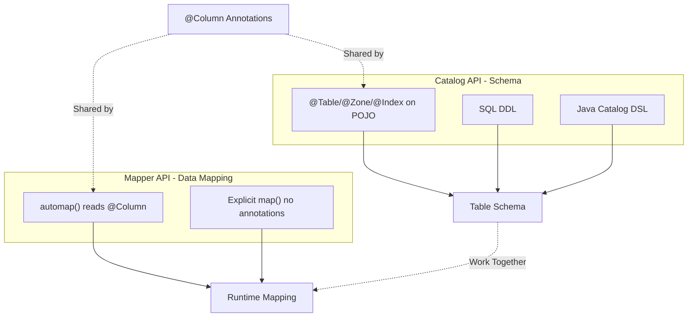

# Schema and Data Mapping in Apache Ignite 3

Your schema came from somewhere. Maybe SQL scripts, maybe another developer, maybe your own DDL. Your application uses `Mapper.of()` for data access, and the workflow is functional. But if your POJO field names don't exactly match your column names, you're writing `map()` calls to bridge them, and that can start to feel heavy.

<!-- truncate -->

Ignite 3 provides a cleaner path. The `catalog.annotations` package lets you define the connection between fields and columns right where you define your classes. When you use `automap()` from the `table.mapper` package, it reads those annotations and builds the mappings for you.

Learn how these packages work together, and your future self will thank you.

## Connecting Schema to Code

Database columns typically use names like `order_date`. Java fields typically use names like `orderDate`. When Ignite normalizes these to uppercase, the SQL column becomes `ORDER_DATE` while the Java field becomes `ORDERDATE`. Different strings that don't map.

The `catalog.annotations` package gives you a way to declare mappings in your POJO:

```java
// @Column declares the column mapping at the source
public class Order {
    @Id
    @Column("ORDER_ID")
    Integer orderId;

    @Column("CUSTOMER_ID")
    String customerId;

    @Column("ORDER_DATE")
    LocalDate orderDate;

    @Column("TOTAL_AMOUNT")
    BigDecimal totalAmount;

    @Column("STATUS")
    String status;
}
```

Each `@Column` annotation tells Ignite exactly which column the field maps to. The annotation value goes through the same normalization as SQL identifiers, so everything lines up.

Now your mapper call becomes straightforward:

```java
// automap() reads @Column annotations and builds mappings automatically
Mapper<Order> mapper = Mapper.builder(Order.class)
    .automap()
    .build();
```

The `automap()` method scans your class, finds the annotations, and builds the mappings. You annotate the POJO once. Every developer who writes a service or batch job using that class gets the mapping without thinking about it. The SRE debugging at 2am can read the class and understand the schema.

If you built your schema with SQL, this approach still works. Add `@Column` annotations to your POJO fields, and `automap()` handles the mapping. Your schema stays in SQL. Your mappings stay visible in your code.

If you want to go further, the `catalog.annotations` package lets you define your entire schema in Java. Annotations like `@Table`, `@Zone`, and `@Index` replace your DDL scripts with compile-time-checked code. The POJO becomes the single source of truth for both schema and mapping. That's a topic for another post, but worth exploring if you prefer keeping schema close to your application code.

## Why This Matters

When the mapping lives on the field, you get benefits that compound over time.

Your IDE becomes more helpful. The `@Column` annotation uses `@Retention(RUNTIME)`, so IntelliJ sees it and can provide context. Hover over a field to see the column name. Use Find Usages to trace references. Refactor with confidence because the annotation moves with the field.

Future you can quickly jump back into the code. When you return to this class in six months, the column name is right there on the field. No hunting through mapper files. No tracing string literals across your codebase. The mapping is visible where you're already looking.

The alternative is explicit `map()` calls scattered through your mapper code:

```java
// Explicit mapping: column names scattered in mapper code, far from fields
Mapper<Order> mapper = Mapper.builder(Order.class)
    .map("orderId", "ORDER_ID")
    .map("customerId", "CUSTOMER_ID")
    .map("orderDate", "ORDER_DATE")
    .map("totalAmount", "TOTAL_AMOUNT")
    .map("status", "STATUS")
    .build();
```

This works, and sometimes it's the right choice. But the column names live far from the fields they describe, which makes the code harder to maintain and gives your IDE less to work with.

## The Packages Work Together

The `@Column` annotation comes from `org.apache.ignite.catalog.annotations`. The `automap()` method comes from `org.apache.ignite.table.mapper`. These are separate packages with separate purposes, but they were designed to complement each other.

When you call `automap()` on a `MapperBuilder`, it scans your class for fields. For each field, it checks for a `@Column` annotation and uses that value as the column name. If there's no annotation, it falls back to the field name, normalized to uppercase. Fields you've already mapped explicitly with `map()` are skipped.

The scanning finds only fields declared directly in your class. If your POJO extends a parent class, inherited fields won't be discovered, even if they have `@Column` annotations. The same applies to `createTable(Class)`. For shared fields across multiple tables, define them in each class or use composition.

This means you can mix approaches when you need to. Use annotations for most fields and explicit mapping for edge cases that require type conversion:

```java
// Mix explicit mapping for type conversion with automap() for everything else
Mapper<Event> mapper = Mapper.builder(Event.class)
    .map("eventDate", "EVENT_DATE", new LocalDateConverter())
    .automap()
    .build();
```

The explicit `map()` handles the field that needs special treatment. The `automap()` handles everything else based on your annotations.

The relationship between these components looks like this:



The `@Column` annotation bridges both APIs, and each API has alternatives. You can define schema with SQL DDL and still use `automap()` for mapping. You can create tables from annotations and still use explicit `map()` calls. The APIs work together but remain independent.

## The Full Annotation Set

Now that you understand how `automap()` reads `@Column`, here's the full toolkit. The `catalog.annotations` package includes more than just `@Column`. If you want to define your entire schema from Java classes, you have the tools:

| Annotation   | Purpose                               |
| ------------ | ------------------------------------- |
| `@Table`     | Table name, zone, indexes, colocation |
| `@Column`    | Column name and properties            |
| `@Id`        | Primary key field                     |
| `@Index`     | Secondary index                       |
| `@ColumnRef` | Column reference for indexes          |
| `@Zone`      | Distribution zone configuration       |

You can use these annotations to generate your schema instead of writing SQL. Or you can use just `@Column` to help your mappers while managing schema separately. The packages support both workflows.

The `table.mapper` package provides the runtime side:

| Component       | Purpose                             |
| --------------- | ----------------------------------- |
| `Mapper.of()`   | Factory for standard mappings       |
| `MapperBuilder` | Fluent API for custom mappings      |
| `TypeConverter` | Type transformation                 |
| `automap()`     | Automatic mapping using annotations |

## Complete Example

Here's a complete example using both packages. The POJO becomes your single source of truth for schema, distribution strategy, and field mappings:

```java
// Single POJO defines everything: schema, zone, indexes, and column mappings
// This class is the source of truth for both DDL generation and runtime mapping
@Table(
    value = "orders",
    zone = @Zone(value = "orders_zone", storageProfiles = "default"),
    colocateBy = @ColumnRef("CUSTOMER_ID"),
    indexes = @Index(value = "idx_order_date", columns = {
        @ColumnRef(value = "ORDER_DATE", sort = SortOrder.DESC)
    })
)
public class Order {
    @Id
    @Column(value = "ORDER_ID", nullable = false)
    Integer orderId;

    @Id  // Part of composite key, required for colocation
    @Column(value = "CUSTOMER_ID", nullable = false)
    String customerId;

    @Column(value = "ORDER_DATE", nullable = false)
    LocalDate orderDate;

    @Column(value = "TOTAL_AMOUNT", precision = 10, scale = 2)
    BigDecimal totalAmount;

    @Column(value = "STATUS", length = 20)
    String status;

    // Constructors, getters, setters...
}
```

Create the table from your annotated class:

```java
// Schema generated from annotations, table created in one call
Table ordersTable = client.catalog().createTable(Order.class);
```

Use the data with a mapper that reads those same annotations:

```java
// RecordView uses your POJO directly
// Mapper reads @Column annotations through automap()
RecordView<Order> orders = ordersTable.recordView(Mapper.of(Order.class));

Order order = new Order(1001, "cust-001", LocalDate.now(),
    new BigDecimal("299.99"), "PENDING");

orders.upsert(null, order);
Order retrieved = orders.get(null, order);  // Key fields identify the record
```

The annotations you wrote for schema creation also drive the runtime mappings. One class, one definition, used everywhere.

## Beyond Annotations

The examples use annotations for both schema definition (`@Table`, `@Zone`, `@Index`) and data mapping (`@Column`). This is the simplest approach when you control both schema and code, but both APIs can also work independently.

**Alternative schema definition:**

- Use SQL DDL instead of `catalog.createTable(Class)` if your schema already exists or your team prefers SQL
- Use the Java Catalog DSL for programmatic schema creation without annotations
- These approaches support schema evolution with `ALTER TABLE` operations

**Alternative data mapping:**

- Use `Mapper.builder().map("field", "COLUMN")` for explicit control without annotations
- Mix explicit mapping with `automap()` for type conversions or special cases
- Create custom `Mapper` implementations for advanced scenarios
- The mapper works regardless of how you created the table

**Schema evolution consideration:**

Annotations provide convenience for the create-once pattern. The `createTable(Class)` method generates schema from your POJO, but it doesn't support altering existing tables. If your application needs to evolve the schema over time, define your tables with SQL DDL. You can still use `@Column` annotations on your POJOs for mapping, even if the table was created with DDL.

The key is that annotations bridge the two APIs when you want them to, but you're not locked into using them for both. Pick the approach that fits your workflow.

## Summary

| Want to...                     | Use this                                       |
| ------------------------------ | ---------------------------------------------- |
| Define column name for a field | `@Column("COLUMN_NAME")`                       |
| Map fields automatically       | `Mapper.builder(Class).automap().build()`      |
| Map a specific field manually  | `.map("fieldName", "COLUMN_NAME")`             |
| Convert types during mapping   | `.map("field", "COLUMN", new TypeConverter())` |
| Create table from annotations  | `client.catalog().createTable(Order.class)`    |

Database conventions and Java conventions don't naturally align, and Ignite's identifier normalization adds another consideration. The `catalog.annotations` package lets you declare the mapping at the source, right on your fields. The `table.mapper` package reads those declarations through `automap()`, turning what could be scattered configuration into a single point of truth.

The result is code that your IDE can help you navigate and that future you can understand without archaeology.

For more details, see the [Creating Tables from Java Classes](https://ignite.apache.org/docs/ignite3/latest/developers-guide/java-to-tables) and [Table API](https://ignite.apache.org/docs/ignite3/latest/developers-guide/table-api) documentation.
