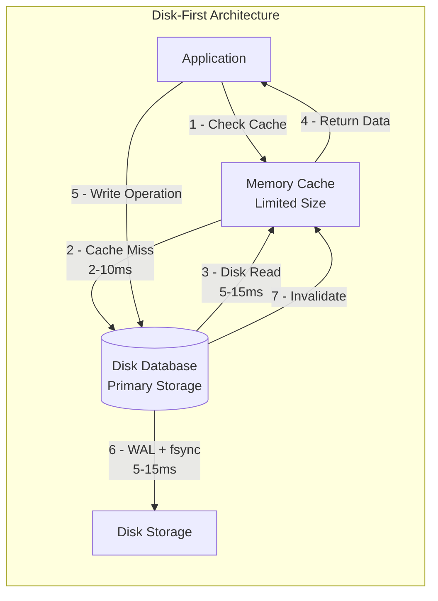
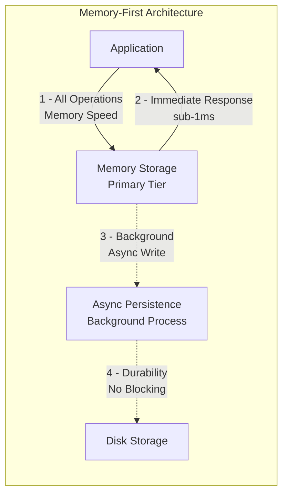

# Apache Ignite 3 Architecture Series: Part 2 — Memory-First Architecture: The Foundation for High-Velocity Event Processing

Traditional databases force a choice: fast memory access or durable storage. High-velocity applications processing 10,000+ events per second hit a wall when disk I/O adds 5-15ms to every transaction.

<!-- truncate -->

**Apache Ignite eliminates this trade-off with memory-first architecture that delivers microsecond response times while maintaining full durability.**

Event data lives in memory for immediate access. Persistence happens asynchronously in the background. By moving operations into memory, typical 7–25 ms disk operations drop into the sub-millisecond range while retaining ACID guarantees.

**Performance transformation: significant speed improvements with enterprise durability.**

---

_Part 2 of 8 in the Apache Ignite 3 Architecture Series_

---

## The Event Processing Performance Challenge

**Traditional Database Performance Under Load**

When applications process high event volumes, disk-based databases create predictable performance degradation:

**Single Event Processing (Traditional Database):**

```java
// Event processing with traditional disk-based database
long startTime = System.nanoTime();
// 1. Check event cache (memory hit ~50μs, miss ~2ms disk fetch)
EventData event = cache.get(eventId);
if (event == null) {
    event = database.query("SELECT * FROM events WHERE id = ?", eventId);  // Disk I/O: 2-10ms
    cache.put(eventId, event, 300);  // Cache update: ~100μs
}
// 2. Transaction processing (requires disk durability)
database.executeTransaction(tx -> {  // WAL write + fsync: 5-15ms
    tx.execute("INSERT INTO event_log VALUES (?, ?)", eventId, timestamp);
    tx.execute("UPDATE event_counters SET count = count + 1");
});
long totalTime = System.nanoTime() - startTime;
// Result: 7-25ms per event (dominated by disk I/O)
```

**Compound Effect at Scale:**

**Mathematical impossibility at scale:**

- 1,000 events/sec × 15ms avg = 15 seconds processing time needed per second
- 5,000 events/sec × 15ms avg = 75 seconds processing time needed per second
- 10,000 events/sec × 15ms avg = 150 seconds processing time needed per second

**The constraint**: Disk I/O creates a performance ceiling on throughput regardless of CPU or memory.

---

## Memory-First Performance Results

**Concrete performance improvement with Apache Ignite memory-first architecture:**

```java
// Event processing with memory-first architecture
long startTime = System.nanoTime();
// All operations happen in memory with microsecond access times
try (IgniteClient client = IgniteClient.builder().addresses("cluster:10800").build()) {
    client.transactions().runInTransaction(tx -> {
        // 1. Event data access (memory-based operations)
        EventData event = eventsTable.get(tx, eventId);
        // 2. Transaction processing (memory-based with async durability)
        client.sql().execute(tx, "INSERT INTO event_log VALUES (?, ?)", eventId, timestamp);
        client.sql().execute(tx, "UPDATE event_counters SET count = count + 1");
        // Transaction commits immediately to memory
        // Disk persistence happens asynchronously in background
    });
}
long totalTime = System.nanoTime() - startTime;
// Result: ~200-500 microseconds per event (20x+ faster than disk-based)
```

**Real-world performance characteristics:**

- **10,000 events/sec processing**: 0.5 seconds total vs 150 seconds with disk I/O
- **Peak throughput**: 50,000+ events per sec achievable vs 1,000 events per sec disk limit
- **Consistent performance**: Sub-millisecond response times even during traffic spikes
- **Resource utilization**: Memory bandwidth becomes the scaling factor, not disk I/O waits

---

## Architecture Comparison: Disk-First vs Memory-First





**The Fundamental Difference:**

- **Traditional**: Memory serves disk (cache-aside pattern with cache misses)
- **Memory-First**: Disk serves memory (async persistence without blocking)
- **Performance Impact**: 5-15ms disk waits become sub-millisecond memory operations
- **Scalability**: Memory bandwidth scales linearly vs disk I/O bottlenecks

---

## Memory-First Architecture Principles

### Off-Heap Memory Management

Apache Ignite manages memory regions directly outside the JVM heap to eliminate garbage collection interference.

**Performance Benefits:**

- **Predictable Access Times**: No Java GC pauses during event processing bursts
- **Large Memory Utilization**: Event data can consume large amounts of RAM without heap issues
- **Direct Memory Operations**: Reduced serialization/deserialization overhead

### Dual Engine Strategy for Event Requirements

Apache Ignite provides two storage engines optimized for different performance requirements:

#### Memory-Only Storage (aimem)

- **Purpose**: Session data, real-time analytics, temporary processing results
- **Performance**: Memory-speed operations without disk I/O overhead
- **Trade-off**: Maximum speed in exchange for volatility

#### Memory-First Persistence (aipersist)

- **Purpose**: Financial transactions, audit logs, business-critical events
- **Performance**: Memory-speed access with asynchronous persistence
- **Trade-off**: Near-memory speed with full durability protection

**The Evolution Solution**: Instead of choosing between fast caches and durable databases, you get both performance characteristics in the same platform based on your specific data requirements.

---

## Event Processing Performance Characteristics

### Memory-First Operations

Event processing benefits from memory-first operations that reduce traditional I/O bottlenecks:

**Architecture Benefits**:

- Events stored in off-heap memory regions for fast access
- Multi-version storage enables concurrent read/write operations
- Asynchronous checkpointing maintains durability without blocking processing
- B+ tree structures optimize both sequential and random access patterns

**Performance Advantage**: Event data processing operates on memory-resident data with minimal serialization overhead.

### Asynchronous Persistence for Event Durability

The checkpoint manager ensures event durability without blocking event processing.

#### Background Checkpoint Process

- **Collection Phase**: Identify modified pages during low-activity periods
- **Write Phase**: Persist changes to storage without blocking ongoing operations
- **Coordination**: Manage recovery markers for failure scenarios

**Key Advantage**: Event processing continues at memory speeds while persistence happens in background threads.

---

## B+ Tree Organization for Event Data

Event-Optimized Data Structures

Apache Ignite organizes event data through specialized B+ tree variations optimized for time-series and event-driven access patterns:

**Event Processing Optimizations**:

- Time-based ordering for streaming access patterns
- Range scan optimization for time window queries
- Cache-friendly layout for sequential event processing
- Multi-version support for consistent read operations

### MVCC Integration for Event Consistency

Event processing maintains consistency through multi-version concurrency control:

**Event Processing Benefits**:

- **Consistent Analytics**: Read events at specific points in time without blocking new events
- **High-Frequency Writes**: Events process concurrently with analytical queries
- **Recovery Guarantees**: Event ordering maintained across failures

---

## Performance Characteristics at Event Scale

### Memory-First Performance Profile

**Event Processing Characteristics**:

- **Write Operations**: Events commit to memory efficiently
- **Read Operations**: Event queries complete quickly from memory
- **Range Scans**: Time-window analytics benefit from memory-resident data
- **Concurrent Processing**: Memory-first design supports mixed read/write loads

**Scaling Characteristics**:

- **Linear Memory Scaling**: Performance grows with available memory
- **CPU Utilization**: Event processing can saturate multiple cores
- **Network Optimization**: Collocated processing eliminates network bottlenecks

### Real-World Event Processing Examples

**Real-World Performance Impact:**

**Financial Trading Platforms**: High-frequency trades process at memory speeds instead of waiting for disk writes. Portfolio updates, risk calculations, and compliance checks happen concurrently without I/O bottlenecks.

**IoT Event Processing**: Sensor data ingestion scales to device-native rates without sampling or queuing delays. Anomaly detection runs on live data streams rather than batch-processed snapshots.

**Gaming Backends**: Player actions process immediately while leaderboards, achievements, and session state update concurrently. No delays between action and world state changes.

---

## Foundation for High-Velocity Applications

Memory-first architecture creates the performance foundation that makes high-velocity event processing practical:

**Eliminates Traditional Bottlenecks**:

- Disk I/O wait times removed from event processing path
- Garbage collection interference eliminated through off-heap design
- Network serialization overhead reduced through efficient memory management

**Enables New Application Patterns**:

- Real-time analytics on live transactional event streams
- Sub-millisecond response capabilities for high-frequency processing
- IoT processing at sensor data rates without data sampling

**Maintains Enterprise Requirements**:

- ACID transaction guarantees for critical events
- Durability through asynchronous checkpointing
- Recovery capabilities for event stream continuity

The memory-first foundation transforms what's possible for high-velocity applications. Instead of architecting around disk I/O constraints, you can design for the performance characteristics your business requirements actually need.

---

_Next: Part 3 explores how flexible schema management lets systems evolve without downtime or complex coordination, and why these capabilities are essential for high-velocity applications that cannot afford processing interruptions._
